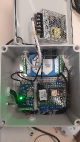
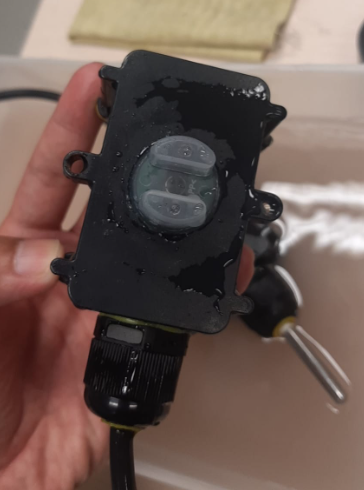

# Lake Toba Monitoring
  
  

 

# Wi-Fi Sensor Node
WiFi Sensor Node for sending data to cloud.  

Flowchart  

  

Firmware is using ESP-IDF Framework

# Lake Monitoring Node
Sensors :  
1. Turbidity
2. Temp
3. pH Sensor

Firmware for Node is using Arduino

# How It Works
Arduino will read data from sensor, then send to Wi-Fi Sensor Node using serial.  
Sensor Node will send data to cloud platform using MQTT.  

Data is acquired periodically.