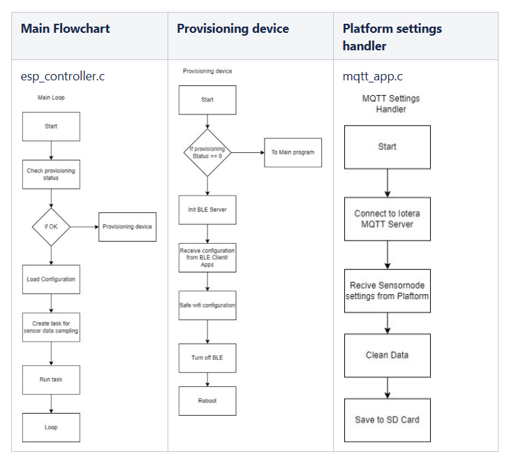

# Wi-Fi Sensor Node
WiFi Sensor Node for sending data to cloud.  

Flowchart  

  

Firmware is using ESP-IDF Framework

# Lake Monitoring Node
Sensors :  
1.Turbidity
2.Temp
3.pH Sensor

Firmware for Node is using Arduino
